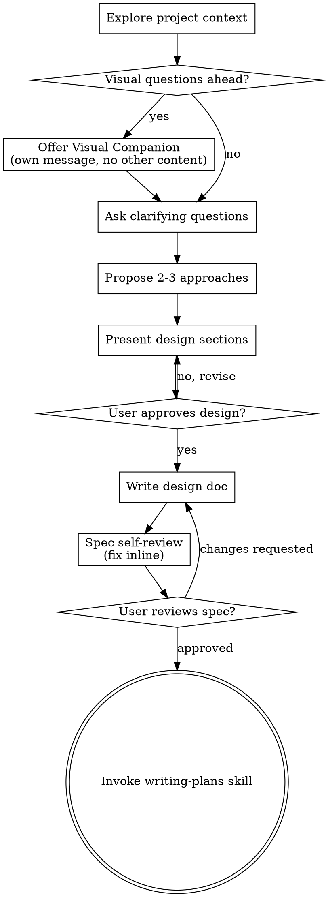
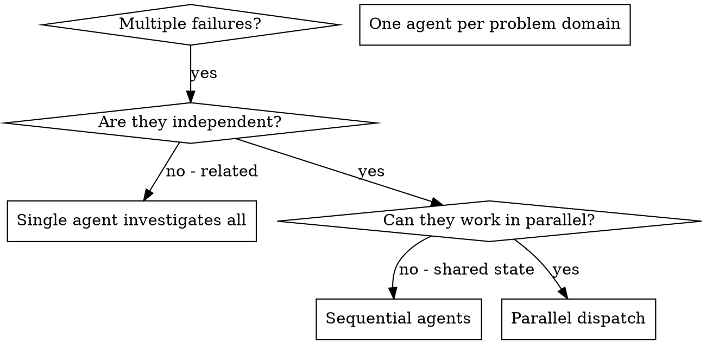

# Hook 注入日志

> 生成时间: 06-06 09:39
> 阶段: requirement
> 本文件每次 session 启动时自动覆盖

[CLAWPIPE — 全 pipeline 通用规则]

## ⚡ CodeGraph 优先（如可用）

如果项目根目录有 `.codegraph/`（codegraph CLI 已索引），**优先用 mcp__codegraph__* MCP tool** 而非 grep / Read / Glob 扫文件：

| 想做的事 | 用 |
|---|---|
| 找符号位置 | `codegraph_search` |
| 理解某区域 / "X 怎么工作" | `codegraph_explore` |
| 看调用链 | `codegraph_callers` / `codegraph_callees` |
| 改前看影响范围 | `codegraph_impact` |
| 单符号完整源（含 overload） | `codegraph_node` |
| 列文件 / 项目结构 | `codegraph_files` |
| 看索引状态 / pending sync | `codegraph_status` |

⛔ 调 codegraph_* 工具的返回结果**视为已读**，**不要再 grep / Read 验证**（除非看到 ⚠️ pending sync banner，那时直接 Read 实时文件）。

若无 `.codegraph/` 目录 → 此段跳过，照旧用 grep / Read。
若 codegraph CLI 未装 → 强烈建议装：
  `curl -fsSL https://raw.githubusercontent.com/colbymchenry/codegraph/main/install.sh | sh && codegraph install`
  装完在 scan 阶段会自动 `codegraph init -i` 建索引。
⚠️ 以下规则在 requirement 阶段强制执行。

[PIPELINE ENFORCE — requirement 阶段]

## 模式：派 spawn_task 出去对话（v1.3.1）

requirement 阶段**强制走 spawn_task 模式** — 把需求探索对话搬到独立 session：
- spawned 是干净 context 的真·新 Claude session（不是 workflow agent），clawpipe SessionStart 注入对它完全生效
- spawned **默认在主 cwd 跑**（spawn_task **不开 worktree** — v1.3.1 实测校正，v1.3 假设错误）
- 这样 spawned 能自己 Read 所有项目文档（产品文档 / scan / figma 产出），主 Agent 不用消化任何上下文

## ⛔ 主 Agent 红线（v1.5.5：含为什么）

派 spawn_task 之前，主 Agent **绝不**做这些：

- ⛔ 不要 Read 产品文档（让 spawned 自己读）
- ⛔ 不要 Read scan / figma 产出（让 spawned 自己读）
- ⛔ 不要提炼"项目专属种子问题"塞给 spawned
- ⛔ 不要在 spawn_task prompt 里二次提炼用户原话

### 为什么这些是红线（理解了才不会再绕开）

spawned 拿到 spawn_task PROMPT 后**按 Step A → B → C → D 串行工作**：

- Step A: **brainstorming 发散**（创造性氛围，开放探索方案空间）
- Step B: 加载 office-hours（显式切换到批判性思维）
- Step C: **office-hours 6 forcing 收敛**（钉到可验收数字 / 条件）
- Step D: 决策汇总 → 用户批准 → 写 PRD

主 Agent 越界做的事 = **批判性思维** = **污染 Step A 的发散氛围**：

| 主 Agent 越界 | 后果 |
|--------------|------|
| Read 产品文档 + 总结成 "## 项目背景" | spawned 跳过 Step A 自己探索的过程，直接拿"现成结论"|
| 提炼"种子问题"塞 prompt | spawned 退化成"按清单走"，brainstorming 退化成多选项问卷 |
| 二次提炼用户原话 | spawned 看到的是主 Agent 的"消化版"，不是用户的"原始信号"|

**实战观察**：主 Agent 越界后，brainstorming / office-hours 的运用空间**塌缩到 5-10%**（spawned 自己审视时的承认值）。

主 Agent 唯一要做：原话落盘 → 派 spawn_task → 等回应 → 回流 → advance。

## Step 0: 用户原始需求落盘

把用户**最近触发 requirement 阶段的输入原文**（含产品文档 / 截图描述 / 关键约束如"只 web 端"）原样写到：

`docs/pipeline/stages/requirement-raw-input.md`

然后 `git add` + `git commit -m "chore: requirement 原始输入归档"`。**不要二次提炼**，spawned 要看原话。

## Step 1: 派 spawn_task

⛔ **v1.5.4 enforcement — spawn-task-guard hook 双重把守**

🚫 **本阶段禁用 `Agent` / `Task` 工具** — guard 会 `permissionDecision: deny` 拦截。
   主 Agent 不能绕开 spawn_task 改派普通 subagent（普通 subagent 没法跟用户对话，违背本阶段对话需求）。
   唯一合法派工方式：`mcp__ccd_session__spawn_task`。

🚫 **spawn_task prompt 违规会被拦**

PreToolUse hook `spawn-task-guard.mjs` 在你调用 `mcp__ccd_session__spawn_task` 时**扫 prompt 内容**，违规会 `permissionDecision: deny` + 修复指引，**调用失败**。所以请：

1. **原样复制下方 ~~~ 之间的 spawn_task PROMPT 模板**到 prompt 字段。**不要二次创作 / 缩水 / 删减**。
2. **不要**在 prompt 里附加 `## 项目背景` / `## 完整 PRD` / `## scan 阶段已查明` / `## 你要跟用户澄清` 等段头（hook 扫这些违规段头会 deny）
3. **不要**自己提炼 6 forcing 种子问题塞 prompt（让 spawned 用 office-hours 自然带出）
4. Hook 还验关键字 `Step A` / `Step B` / `Step C` / `Step D` / `HARD GATE` 必须存在（说明 spawn_task PROMPT 模板原样复制了）
5. prompt 长度限 1500–6000 字符（过短 = 模板缺失；过长 = 二次创作）

项目专属内容 → 已经在 Step 0 落到 `docs/pipeline/stages/requirement-raw-input.md`，spawned 必读那个文件。

### 调用 `mcp__ccd_session__spawn_task`

- `title`: `requirement: <一句话需求摘要>`（≤ 60 字符）
- `tldr`: `新 session 自读项目文档 + 跟用户深聊 + 产 PRD`
- `prompt`: 把下方"spawn_task PROMPT"整段（~~~ 之间的全部）**原样**传入

### spawn_task PROMPT

~~~
你是 clawpipe pipeline 的 requirement 阶段执行者。本会话目的：自己消化项目上下文，跟用户深聊清楚需求，产出 PRD + checkpoint。

⛔ 主 Agent 不会替你做项目上下文消化，不会替你提种子问题。你自己读、自己提、自己问。

## 开聊前必读（按顺序，缺一不可）

1. **docs/pipeline/stages/requirement-raw-input.md** — 用户原始需求原文（产品文档 / 关键约束）
2. **docs/pipeline/stages/scan.md**（如存在）— 项目基线
3. **docs/design/<项目>/components.md**（如存在）— 既有组件清单
4. **docs/design/<项目>/color-mapping.md**（如存在）— 既有色值
5. **docs/pipeline/context/*.design.md**（如 figma 阶段已跑）— 设计结构
6. **docs/pipeline/context/*.json**（如 figma 阶段已跑）— 精确数值

读完后用 Skill tool 加载：
- `superpowers:brainstorming`（核心循环：探用户意图 / 一次一问 / 先呈现再批准 / Phase 4 方案对比）
- `office-hours`（6 forcing + 项目专属追问）

## 任务（v1.5.1：先发散后收敛，不在风暴前预先批判）

⚠️ **顺序铁律**：必须按 Step A → B → C → D 跑。**不要**在 Step A 之前预先"找产品文档矛盾 / 含糊数字 / gap" — 那是批判性思维，会污染 brainstorming 的创造性氛围。让 Step C 的 office-hours 6 forcing 自然把这些带出来。

### Step A: 发散阶段 — 用 brainstorming（重创造性氛围）

加载 brainstorming skill 后，基于读过的产品文档 / scan / 真实代码：

1. **开放探索方案空间** — 不挑刺、不预设矛盾、不预先找含糊点
2. **对每个关键决策**（IA 重构 / 卡生命周期 / 转网交互 / 主导航重组 / 主题色映射 等）**真正提出 2-3 个独立 approach** — 不是把选项塞进 AskUserQuestion 当多选项给用户答（那是问卷不是头脑风暴）
3. 每个 approach 给：**Effort（开发量）/ Risk（风险）/ Pros / Cons / 你的推荐**
4. 让用户感觉"在选方案"不是"答问卷"
5. **HARD GATE: 不批准不落盘** — 用户没明确 approve 某个 approach，不要往 PRD 写

⚠️ 前一轮 spawned 自审时承认偷工的就是这一步（把 approach 退化成 AskUserQuestion 多选项）。这次不要再省。

⚠️ 让 brainstorming 自身的 Phase 2 澄清问题 + Phase 3 Premise Challenge **自然带出**矛盾 / 含糊点 — 不要预先列清单。

### Step B: 加载 office-hours

用户选定 approach 后，Skill tool 加载 office-hours。**这才是切换到批判性思维的时机**。

### Step C: 收敛阶段 — office-hours 6 forcing 自然提炼 + 钉具体

用 6 forcing 框架钉到可验收的数字 / 条件 — 矛盾 / 含糊数字 / gap 是 forcing **自然带出来的**，不是预先列好的：

- **真实需求** — 这功能是用户主动要求还是你猜的？
- **现状对比** — 用户现在用什么替代？为啥不够好？
  → 自然暴露现有页面 vs 新需求的 gap
- **必要的具体性** — "更好"是多好？给可验证指标（RT / 转化 / 错误率）
  → 自然暴露含糊数字（"10u 起不设限" → 5000u 跟 10u 的额度怎么算？）
- **最窄楔子** — MVP 砍 80% 留什么？
- **观察证据** — 访谈 / 数据 / 二手反馈？
- **未来契合** — 6 个月后还重要吗？

含糊就追问那一条，**不要替用户编答案**。

如果发现产品文档自相矛盾（如"NFT 锁仓"和"销毁激活"是同一个 NFT 吗？），用 office-hours 的 forcing 跟用户澄清，**不要替用户编**。

### Step D: 决策汇总 → 先呈现 → 用户批准 → 才动笔写 PRD

- 全程**一次一问**（每个 AskUserQuestion 只问 1 个问题）
- 决策汇总表先给用户看一眼批准，再开始写 PRD 主体
- Premise Challenge 有价值就用（"这真是问题吗？不做会怎样？"）

## 产出（两份文件，缺一不可）

### 1. docs/pipeline/stages/requirement.md（PRD 主体，章节结构自由）

包含但不限于：用户故事 / 关键决策表 / 页面优先级 / 范围红线 / 移交下一阶段。

### 2. docs/pipeline/checkpoints/stage-requirement-done.md（验收单，固定 5 字段）

```md
# stage-requirement-done

### 真实需求
（forcing #1 的具体回答，≥ 30 字）

### 现状对比
（forcing #2：替代方案 + 为何不够好）

### 最窄楔子
（forcing #4：MVP 范围 + 砍掉功能列表）

### 观察证据
（forcing #5：访谈 / 数据 / 二手反馈，无访谈则注明"基于产品文档推导"）

### 阶段产出文件
docs/pipeline/stages/requirement.md
```

⚠️ checkpoint 5 字段是 advance hook 硬验证的。**漏写 checkpoint** → 主 Agent 回流时被 advance 拦 → 它会自己从 PRD 提取补写（fallback 机制），但你写一份省主 Agent 一道工序。

## 提交 + 通知

1. `git add docs/pipeline/stages/requirement.md docs/pipeline/checkpoints/stage-requirement-done.md`
2. `git commit -m "feat: requirement 阶段 PRD"`
3. 告诉用户："PRD 已 commit。请回主 session 说'继续'，主 Agent 会自动 advance 推进。"

## 限制

- 不写业务代码（只产 PRD）
- 不派 subagent（你自己跟用户对话）
- commit 后停下来等用户回主 session，不要主动推进 stage
~~~

## Step 2: 派完后停手

调用 spawn_task 返回成功后：
1. 告诉用户：「已派 spawn_task 出去跟你深聊需求。请点击 chip 进入新 session 对话；对话完成后回主 session 说"继续"，我会自动拉回产物并推进。」
2. **不要**自己跟用户继续聊需求（spawned 已经在聊）
3. 停下来等用户回应

## Step 3: 用户说「继续」时——回流产物

⚠️ v1.3.1 校正：spawn_task **不开 worktree**，spawned 直接在主 cwd 跑、直接在 main 分支 commit。所以**不需要** `git worktree list` / `git merge` — 产物已经在 main。

```bash
# 1. 看 spawned 的 commit
git log --oneline -3

# 2. 验产物
test -f docs/pipeline/stages/requirement.md && echo "✅ PRD" || echo "⛔ 缺 PRD"
test -f docs/pipeline/checkpoints/stage-requirement-done.md && echo "✅ checkpoint" || echo "⛔ 缺 checkpoint"
```

### 如果 checkpoint 缺失 — fallback（v1.3.1 实测发现常见）

spawned 可能漏写 checkpoint。主 Agent 自己补：

1. Read `docs/pipeline/stages/requirement.md`
2. 从 PRD 内容**提取**映射到 5 字段（不要凭空捏造，找不到的字段填"基于 PRD 未明确，待 design 阶段补"）：
   - 真实需求 ← PRD "用户痛点" / "目标用户" / "用户故事" 段
   - 现状对比 ← PRD "现状 vs 改进" / "替代方案" 段
   - 最窄楔子 ← PRD "MVP 范围" / "P0 功能" / "范围红线" 段
   - 观察证据 ← PRD "数据 / 反馈" 段
   - 阶段产出文件 ← `docs/pipeline/stages/requirement.md`
3. Write `docs/pipeline/checkpoints/stage-requirement-done.md`
4. `git add` + `git commit -m "feat: requirement 阶段 checkpoint 补全（从 PRD 提取）"`

### 推进到 design

下一次 Edit / Write 触发 advance hook → 校验 checkpoint 5 字段 → 全填 → 自动推进到 design。

## 完成判据
`stage-requirement-done.md` 5 个三级标题字段全填，无占位词（"未填" / "___" / "pass" / "ok"）。

# 主 Agent Skills（requirement 阶段必读）

## 主 Agent 必读 Skill: brainstorming

---
name: brainstorming
description: "You MUST use this before any creative work - creating features, building components, adding functionality, or modifying behavior. Explores user intent, requirements and design before implementation."
---

# Brainstorming Ideas Into Designs

Help turn ideas into fully formed designs and specs through natural collaborative dialogue.

Start by understanding the current project context, then ask questions one at a time to refine the idea. Once you understand what you're building, present the design and get user approval.

<HARD-GATE>
Do NOT invoke any implementation skill, write any code, scaffold any project, or take any implementation action until you have presented a design and the user has approved it. This applies to EVERY project regardless of perceived simplicity.
</HARD-GATE>

## Anti-Pattern: "This Is Too Simple To Need A Design"

Every project goes through this process. A todo list, a single-function utility, a config change — all of them. "Simple" projects are where unexamined assumptions cause the most wasted work. The design can be short (a few sentences for truly simple projects), but you MUST present it and get approval.

## Checklist

You MUST create a task for each of these items and complete them in order:

1. **Explore project context** — check files, docs, recent commits
2. **Offer visual companion** (if topic will involve visual questions) — this is its own message, not combined with a clarifying question. See the Visual Companion section below.
3. **Ask clarifying questions** — one at a time, understand purpose/constraints/success criteria
4. **Propose 2-3 approaches** — with trade-offs and your recommendation
5. **Present design** — in sections scaled to their complexity, get user approval after each section
6. **Write design doc** — save to `docs/superpowers/specs/YYYY-MM-DD-<topic>-design.md` and commit
7. **Spec self-review** — quick inline check for placeholders, contradictions, ambiguity, scope (see below)
8. **User reviews written spec** — ask user to review the spec file before proceeding
9. **Transition to implementation** — invoke writing-plans skill to create implementation plan

## Process Flow



**The terminal state is invoking writing-plans.** Do NOT invoke frontend-design, mcp-builder, or any other implementation skill. The ONLY skill you invoke after brainstorming is writing-plans.

## The Process

**Understanding the idea:**

- Check out the current project state first (files, docs, recent commits)
- Before asking detailed questions, assess scope: if the request describes multiple independent subsystems (e.g., "build a platform with chat, file storage, billing, and analytics"), flag this immediately. Don't spend questions refining details of a project that needs to be decomposed first.
- If the project is too large for a single spec, help the user decompose into sub-projects: what are the independent pieces, how do they relate, what order should they be built? Then brainstorm the first sub-project through the normal design flow. Each sub-project gets its own spec → plan → implementation cycle.
- For appropriately-scoped projects, ask questions one at a time to refine the idea
- Prefer multiple choice questions when possible, but open-ended is fine too
- Only one question per message - if a topic needs more exploration, break it into multiple questions
- Focus on understanding: purpose, constraints, success criteria

**Exploring approaches:**

- Propose 2-3 different approaches with trade-offs
- Present options conversationally with your recommendation and reasoning
- Lead with your recommended option and explain why

**Presenting the design:**

- Once you believe you understand what you're building, present the design
- Scale each section to its complexity: a few sentences if straightforward, up to 200-300 words if nuanced
- Ask after each section whether it looks right so far
- Cover: architecture, components, data flow, error handling, testing
- Be ready to go back and clarify if something doesn't make sense

**Design for isolation and clarity:**

- Break the system into smaller units that each have one clear purpose, communicate through well-defined interfaces, and can be understood and tested independently
- For each unit, you should be able to answer: what does it do, how do you use it, and what does it depend on?
- Can someone understand what a unit does without reading its internals? Can you change the internals without breaking consumers? If not, the boundaries need work.
- Smaller, well-bounded units are also easier for you to work with - you reason better about code you can hold in context at once, and your edits are more reliable when files are focused. When a file grows large, that's often a signal that it's doing too much.

**Working in existing codebases:**

- Explore the current structure before proposing changes. Follow existing patterns.
- Where existing code has problems that affect the work (e.g., a file that's grown too large, unclear boundaries, tangled responsibilities), include targeted improvements as part of the design - the way a good developer improves code they're working in.
- Don't propose unrelated refactoring. Stay focused on what serves the current goal.

## After the Design

**Documentation:**

- Write the validated design (spec) to `docs/superpowers/specs/YYYY-MM-DD-<topic>-design.md`
  - (User preferences for spec location override this default)
- Use elements-of-style:writing-clearly-and-concisely skill if available
- Commit the design document to git

**Spec Self-Review:**
After writing the spec document, look at it with fresh eyes:

1. **Placeholder scan:** Any "TBD", "TODO", incomplete sections, or vague requirements? Fix them.
2. **Internal consistency:** Do any sections contradict each other? Does the architecture match the feature descriptions?
3. **Scope check:** Is this focused enough for a single implementation plan, or does it need decomposition?
4. **Ambiguity check:** Could any requirement be interpreted two different ways? If so, pick one and make it explicit.

Fix any issues inline. No need to re-review — just fix and move on.

**User Review Gate:**
After the spec review loop passes, ask the user to review the written spec before proceeding:

> "Spec written and committed to `<path>`. Please review it and let me know if you want to make any changes before we start writing out the implementation plan."

Wait for the user's response. If they request changes, make them and re-run the spec review loop. Only proceed once the user approves.

**Implementation:**

- Invoke the writing-plans skill to create a detailed implementation plan
- Do NOT invoke any other skill. writing-plans is the next step.

## Key Principles

- **One question at a time** - Don't overwhelm with multiple questions
- **Multiple choice preferred** - Easier to answer than open-ended when possible
- **YAGNI ruthlessly** - Remove unnecessary features from all designs
- **Explore alternatives** - Always propose 2-3 approaches before settling
- **Incremental validation** - Present design, get approval before moving on
- **Be flexible** - Go back and clarify when something doesn't make sense

## Visual Companion

A browser-based companion for showing mockups, diagrams, and visual options during brainstorming. Available as a tool — not a mode. Accepting the companion means it's available for questions that benefit from visual treatment; it does NOT mean every question goes through the browser.

**Offering the companion:** When you anticipate that upcoming questions will involve visual content (mockups, layouts, diagrams), offer it once for consent:
> "Some of what we're working on might be easier to explain if I can show it to you in a web browser. I can put together mockups, diagrams, comparisons, and other visuals as we go. This feature is still new and can be token-intensive. Want to try it? (Requires opening a local URL)"

**This offer MUST be its own message.** Do not combine it with clarifying questions, context summaries, or any other content. The message should contain ONLY the offer above and nothing else. Wait for the user's response before continuing. If they decline, proceed with text-only brainstorming.

**Per-question decision:** Even after the user accepts, decide FOR EACH QUESTION whether to use the browser or the terminal. The test: **would the user understand this better by seeing it than reading it?**

- **Use the browser** for content that IS visual — mockups, wireframes, layout comparisons, architecture diagrams, side-by-side visual designs
- **Use the terminal** for content that is text — requirements questions, conceptual choices, tradeoff lists, A/B/C/D text options, scope decisions

A question about a UI topic is not automatically a visual question. "What does personality mean in this context?" is a conceptual question — use the terminal. "Which wizard layout works better?" is a visual question — use the browser.

If they agree to the companion, read the detailed guide before proceeding:
`skills/brainstorming/visual-companion.md`


# 主 Agent 全局 Skills（跨所有 stage 适用）

## 主 Agent 全局 Skill: dispatching-parallel-agents

---
name: dispatching-parallel-agents
description: Use when facing 2+ independent tasks that can be worked on without shared state or sequential dependencies
---

# Dispatching Parallel Agents

## Overview

You delegate tasks to specialized agents with isolated context. By precisely crafting their instructions and context, you ensure they stay focused and succeed at their task. They should never inherit your session's context or history — you construct exactly what they need. This also preserves your own context for coordination work.

When you have multiple unrelated failures (different test files, different subsystems, different bugs), investigating them sequentially wastes time. Each investigation is independent and can happen in parallel.

**Core principle:** Dispatch one agent per independent problem domain. Let them work concurrently.

## When to Use



**Use when:**
- 3+ test files failing with different root causes
- Multiple subsystems broken independently
- Each problem can be understood without context from others
- No shared state between investigations

**Don't use when:**
- Failures are related (fix one might fix others)
- Need to understand full system state
- Agents would interfere with each other

## The Pattern

### 1. Identify Independent Domains

Group failures by what's broken:
- File A tests: Tool approval flow
- File B tests: Batch completion behavior
- File C tests: Abort functionality

Each domain is independent - fixing tool approval doesn't affect abort tests.

### 2. Create Focused Agent Tasks

Each agent gets:
- **Specific scope:** One test file or subsystem
- **Clear goal:** Make these tests pass
- **Constraints:** Don't change other code
- **Expected output:** Summary of what you found and fixed

### 3. Dispatch in Parallel

```typescript
// In Claude Code / AI environment
Task("Fix agent-tool-abort.test.ts failures")
Task("Fix batch-completion-behavior.test.ts failures")
Task("Fix tool-approval-race-conditions.test.ts failures")
// All three run concurrently
```

### 4. Review and Integrate

When agents return:
- Read each summary
- Verify fixes don't conflict
- Run full test suite
- Integrate all changes

## Agent Prompt Structure

Good agent prompts are:
1. **Focused** - One clear problem domain
2. **Self-contained** - All context needed to understand the problem
3. **Specific about output** - What should the agent return?

```markdown
Fix the 3 failing tests in src/agents/agent-tool-abort.test.ts:

1. "should abort tool with partial output capture" - expects 'interrupted at' in message
2. "should handle mixed completed and aborted tools" - fast tool aborted instead of completed
3. "should properly track pendingToolCount" - expects 3 results but gets 0

These are timing/race condition issues. Your task:

1. Read the test file and understand what each test verifies
2. Identify root cause - timing issues or actual bugs?
3. Fix by:
   - Replacing arbitrary timeouts with event-based waiting
   - Fixing bugs in abort implementation if found
   - Adjusting test expectations if testing changed behavior

Do NOT just increase timeouts - find the real issue.

Return: Summary of what you found and what you fixed.
```

## Common Mistakes

**❌ Too broad:** "Fix all the tests" - agent gets lost
**✅ Specific:** "Fix agent-tool-abort.test.ts" - focused scope

**❌ No context:** "Fix the race condition" - agent doesn't know where
**✅ Context:** Paste the error messages and test names

**❌ No constraints:** Agent might refactor everything
**✅ Constraints:** "Do NOT change production code" or "Fix tests only"

**❌ Vague output:** "Fix it" - you don't know what changed
**✅ Specific:** "Return summary of root cause and changes"

## When NOT to Use

**Related failures:** Fixing one might fix others - investigate together first
**Need full context:** Understanding requires seeing entire system
**Exploratory debugging:** You don't know what's broken yet
**Shared state:** Agents would interfere (editing same files, using same resources)

## Real Example from Session

**Scenario:** 6 test failures across 3 files after major refactoring

**Failures:**
- agent-tool-abort.test.ts: 3 failures (timing issues)
- batch-completion-behavior.test.ts: 2 failures (tools not executing)
- tool-approval-race-conditions.test.ts: 1 failure (execution count = 0)

**Decision:** Independent domains - abort logic separate from batch completion separate from race conditions

**Dispatch:**
```
Agent 1 → Fix agent-tool-abort.test.ts
Agent 2 → Fix batch-completion-behavior.test.ts
Agent 3 → Fix tool-approval-race-conditions.test.ts
```

**Results:**
- Agent 1: Replaced timeouts with event-based waiting
- Agent 2: Fixed event structure bug (threadId in wrong place)
- Agent 3: Added wait for async tool execution to complete

**Integration:** All fixes independent, no conflicts, full suite green

**Time saved:** 3 problems solved in parallel vs sequentially

## Key Benefits

1. **Parallelization** - Multiple investigations happen simultaneously
2. **Focus** - Each agent has narrow scope, less context to track
3. **Independence** - Agents don't interfere with each other
4. **Speed** - 3 problems solved in time of 1

## Verification

After agents return:
1. **Review each summary** - Understand what changed
2. **Check for conflicts** - Did agents edit same code?
3. **Run full suite** - Verify all fixes work together
4. **Spot check** - Agents can make systematic errors

## Real-World Impact

From debugging session (2025-10-03):
- 6 failures across 3 files
- 3 agents dispatched in parallel
- All investigations completed concurrently
- All fixes integrated successfully
- Zero conflicts between agent changes


[阶段完成协议] 完成 requirement 时: ①写 stages/requirement.md ②更新 pipeline.json ③汇报

---
> [pipeline-init-check] 06-06 09:39

📋 当前项目无架构地图（.claude/CLAUDE.md），建议让 Claude 扫描项目生成一份，后续对话可快速了解项目脉络。
📍 Pipeline: [项目基线扫描 ✅] [→需求探索与明确 ⬜] [设计分析 ⬜] [三角色架构审查 ⬜] [任务拆解与增量比对 ⬜] [编码实现 ⬜] [测试 ⬜] [代码审查 ⬜] [发布 PR ⬜] [复盘 ⬜]
📝 需求: Link World 去中心化通信平台 web 端重构（仅 packages/web）。核心功能：连接钱包+邮箱注册、提交保证金锁仓获得流量卡 NFT（10u 起、锁仓1月、销毁后30天有效）、自动转网选择目的地运营商流量、去中心化身份(binance/okx 钱包)、NFT 逐月积累不可转卖、对接运营商购买通讯服务(1.5% 手续费)、实体 SIM 卡线下/邮寄领取。重构含全新主题色：深蓝渐变 linear-gradient(135deg, #0C2340 0%, #1E40AF 50%)。
Gate 1（设计）| 当前: 需求探索与明确 | Skills: 无
